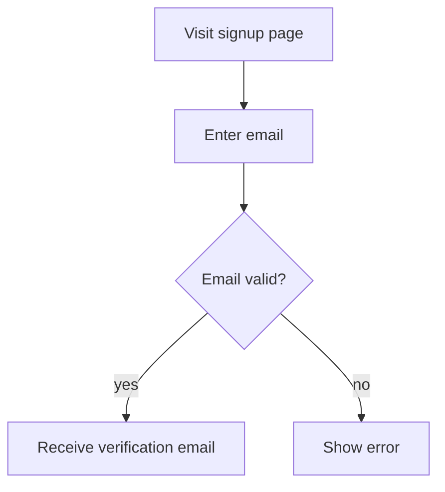

# Signup Flow Drops 38% of Users

```mermaid
flowchart TD
    A[Visit signup page] --> B[Enter email]
    B --> C{Email valid?}
    C -- yes --> D[Receive verification email]
    C -- no --> E[Show error]
```

Source: signup funnel telemetry.
